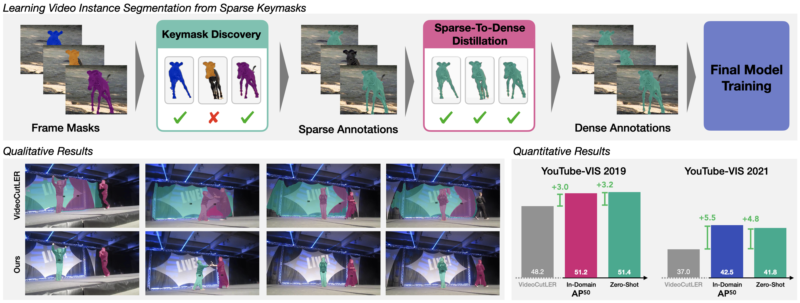

# S2D: Sparse-To-Dense Keymask Distillation For Unsupervised Video Instance Segmentation

S2D is a simple unsupervised video instance segmentation (UVIS) method. ***Our approach is trained exclusively on video data without using any human annotations, avoid synthetic videos (ImageNet data) entire.***    


> [**S2D: Sparse-To-Dense Keymask Distillation For Unsupervised Video Instance Segmentation**](https://leonsick.github.io/s2d/)            
> [Leon Sick](https://leonsick.github.io/), [Lukas Hoyer](https://lhoyer.github.io/), [Dominik Engel](https://dominikengel.com/), [Pedro Hermosilla](https://phermosilla.github.io/), [Timo Ropinski](https://viscom.uni-ulm.de/members/timo-ropinski/)             
> Ulm University, Google, KAUST, TU Vienna             

[[`arxiv`](https://arxiv.org/pdf/2512.14440)]             


Note: This repository is currently under development. We will provide detailed instructions for keymask discovery and model training soon.

## Dataset Preparation
Follow the data preparation process from [VideoCutLER](datasets/README.md).


## Method Overview
<p align="center">
  
</p>
S2D has three main stages:  

1) First, we predict single-frame masks using a SOTA unsupervised image instance segmentation model, CutS3D. Please find the weights [here](https://drive.google.com/drive/folders/1i2clWjOXeL5tQ1HhqBByhXnwcWkkED65?usp=share_link). 
2) We then perform Keymask Discovery to identify temporally-coherent, high-quality keymasks across the video. 
3) Finally, we perform Sparse-To-Dense Keymask Distillation to train a video instance segmentation model using the discovered keymasks. This is followed by another round of self-distillation.


## Inference Demo for VideoCutLER with Pre-trained Models

We provide `demo_video/demo.py` that is able to demo builtin configs. Run it with:
```
cd model_training
python demo_video/demo.py \
  --config-file configs/imagenet_video/s2d_inference_kd_video_mask2former_R50_cls_agnostic.yaml \
  --input <your-video-path>/*.jpg \
  --confidence-threshold 0.8 \
  --output imgs/ \
  --opts MODEL.WEIGHTS s2d_zeroshot.pth
```
Our zero-shot S2D model, trained on a mixture-of-datasets (SA-V, MOSE, VIPSeg) can be obtained from [here](https://drive.google.com/drive/folders/1RavlAUlnehYAe4ymnSEFeL7i1lrh_c1n?usp=share_link). Then you should specify `MODEL.WEIGHTS` to the model checkpoint for evaluation.
Above command will run the inference and show visualizations in an OpenCV window, and save the results in the mp4 format.
For details of the command line arguments, see `demo.py -h` or look at its source code to understand its behavior. Some common arguments are:
<!-- * To save outputs to a directory (for videos), use `--output`. -->
* To get a higher recall, use a smaller `--confidence-threshold`.
* To save each frame's segmentation result, add `--save-frames True` before `--opts`.
* To save each frame's segmentation masks, add `--save-masks True` before `--opts`.


### Unsupervised Zero-shot Evaluation
To evaluate a model's performance on various datasets, such as YouTubeVIS-2021, please refer to [datasets/README.md](datasets/README.md) for instructions on preparing the datasets. Next, download the [model weights](https://drive.google.com/file/d/11TACB8tOaAc-eXBo_i2arR_7qgGSeXRg/view?usp=drive_link), specify the "model_weights", "config_file" and the path to "DETECTRON2_DATASETS", then run the following commands. 
```
export DETECTRON2_DATASETS=/PATH/TO/DETECTRON2_DATASETS/
CUDA_VISIBLE_DEVICES=0 python train_net_video.py --num-gpus 4 \
  --config-file configs/imagenet_video/s2d_inference_kd_video_mask2former_R50_cls_agnostic.yaml \
  --eval-only MODEL.WEIGHTS s2d_zeroshot.pth \
  OUTPUT_DIR OUTPUT-DIR/ytvis_2021 DATASETS.TEST '("ytvis_2021_val",)'
```

### Instructions for Keymask Discovery and Model Training
We will provide detailed instructions soon.
ToDos:
- [ ] Provide installation instructions
- [ ] Write instructions for Single-Frame Mask Prediction with CutS3D
- [ ] Write instructions for Keymask Discovery
- [ ] Write instructions for Sparse-To-Dense Keymask Distillation


## Acknowledgements
Our code is in large parts based on the [VideoCutLER](https://github.com/facebookresearch/CutLER/tree/main/videocutler) implementation. Thank you to the authors for releasing their code.


## How to get support from us?
If you have any general questions, feel free to email us at [Leon Sick](mailto:leon.sick@uni-ulm.de). If you have code or implementation-related questions, please feel free to send emails to us. 


## Citation
If you find our work inspiring or use our codebase in your research, please consider giving a star ⭐ and a citation.
```
@article{sick2025s2d,
  title={S2D: Sparse-To-Dense Keymask Distillation For Unsupervised Video Instance Segmentation},
  author={Sick, Leon and Hoyer, Lukas and Engel, Dominik and Hermosilla, Pedro and Ropinski, Timo},
  journal={arXiv preprint arXiv:2512.14440},
  year={2025}
}
```
